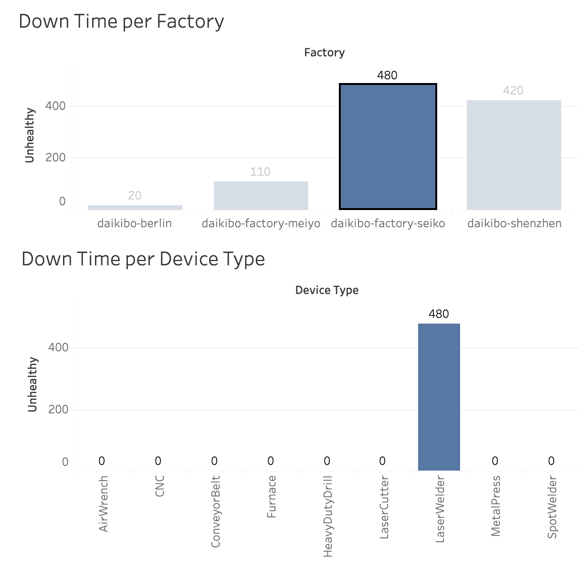

# Deloitte – Data Analytics Job Simulation (Forage)

**Author:** Fariba Kazi

Completed the Deloitte Australia Data Analytics & Forensic Technology virtual job
simulation on Forage, acting as a data analyst for the fictional client **Daikibo
Industrials**.

---

## Task 1 — Machine Downtime Dashboard (Tableau)
**Problem:** Daikibo unified one month of IoT telemetry from 4 global factories and
needed to know where machines were failing most.

**Approach:** Built an `Unhealthy` measure (10 min of downtime per "unhealthy"
status message), created two bar charts (downtime per factory, downtime per device
type), and combined them into a dashboard where selecting a factory filters the
device chart.

**Result:** **Factory Seiko (Osaka)** had the most downtime (480 min), entirely from
the **Laser Welder** — pointing to a single prolonged outage rather than scattered
failures.

---

## Task 2 — Gender Pay-Equality Classification (Excel)
**Problem:** Investigate internal complaints of pay inequality using a forensic
equality score (−100 to +100, 0 = ideal) per job role and factory.

**Approach:** Added an **Equality class** column classifying each score:
- **Fair** — within ±10
- **Unfair** — beyond ±10 up to ±20
- **Highly Discriminative** — beyond ±20

Implemented as a formula so it recalculates automatically:
`=IF(ABS(C2)<=10,"Fair",IF(ABS(C2)<=20,"Unfair","Highly Discriminative"))`

**File:** `daikibo-equality-table-completed.xlsx`

---

## Skills
Data visualisation · Dashboard design · Tableau · Excel logic · Trend analysis
